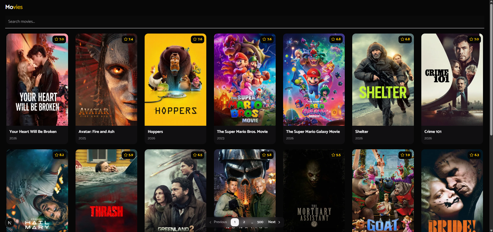
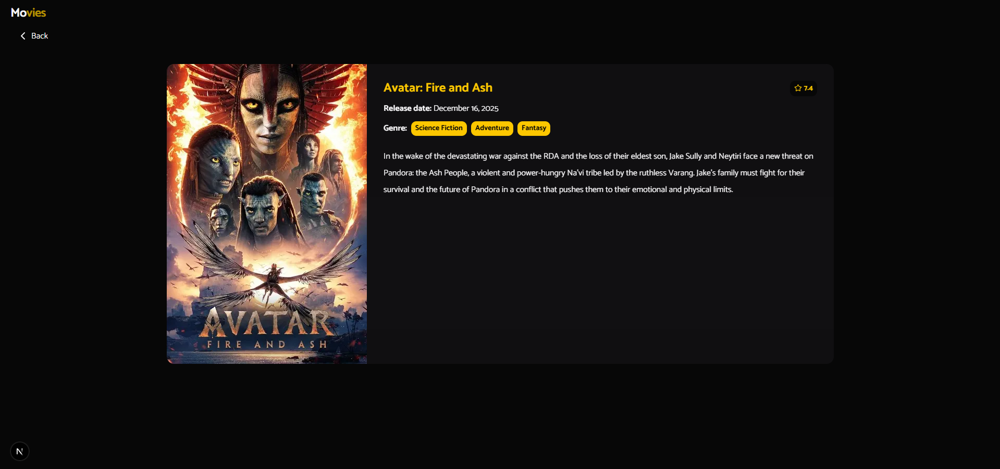

# 🎬 Movies App

A responsive movie listing application built with **Next.js** and powered by **The Movie Database (TMDB) API**. Browse, search, and explore movie details with a smooth and animated UI.

---

## 🖥️ Screenshots

| Home | Movie Details |
|------|---------------|
|  |  |

---

## ✨ Features

- 🎞 **Movie listing** — Browse movies with poster, title, year, and rating
- 🔍 **Client-side search with debounce** — Live filtering as you type, optimized to avoid unnecessary API calls
- 💀 **Skeleton loading** — Animated placeholders shown while data is being fetched
- 📄 **Pagination** — Navigate through hundreds of pages of movies
- 🎬 **Movie detail page** — Dedicated route with poster, genres, release date, rating, and synopsis
- ⚠️ **Empty & error states** — Friendly feedback when no results are found or the API is unavailable
- ✨ **Animations** — Smooth transitions and micro-interactions throughout the interface
- 📱 **Fully responsive** — Works seamlessly on mobile, tablet, and desktop

---

## 🛠️ Tech Stack

| Tool | Purpose |
|------|---------|
| [Next.js 15](https://nextjs.org/) (via `create-next-app`) | React framework |
| [TypeScript](https://www.typescriptlang.org/) | Type safety |
| [TanStack Query](https://tanstack.com/query) | Data fetching & caching |
| [The Movie Database API](https://www.themoviedb.org/documentation/api) | Movie data source |
| [Tailwind CSS](https://tailwindcss.com/) | Styling |
| [shadcn/ui](https://ui.shadcn.com/) | UI component library |
| [class-variance-authority](https://cva.style/) | Variant-based component styling |
| [lucide-react](https://lucide.dev/) | Icon set |

---

## 🚀 Getting Started

### Prerequisites

- Node.js 18+
- A free [TMDB API key](https://www.themoviedb.org/settings/api)

### Installation

```bash
# Clone the repository
git clone https://github.com/jeffersonsil813/movie-catalog
cd movie-catalog

# Install dependencies
yarn
# or
npm install
```

### Environment Variables

Create a `.env.local` file in the root of the project:

```env
NEXT_PUBLIC_TMDB_API_KEY=your_tmdb_api_key_here
```

### Running the development server

```bash
yarn dev
# or
npm run dev
```

Open [http://localhost:3000](http://localhost:3000) in your browser.

### Building for production

```bash
yarn build && yarn start
# or
npm run build && npm start
```

---

## 🌐 Live Demo

> 🔗 _Deploy link coming soon.._

---

## 📁 Project Structure

```
├── app/
│   ├── page.tsx          # Home — movie listing with search & pagination
│   └── movie/
│       └── [id]/
│           └── page.tsx  # Movie detail page
├── components/           # Reusable UI components
├── hooks/                # Custom React hooks
├── lib/                  # API helpers and utilities
└── models/                # TypeScript type definitions
```

---

## 📝 License

This project is open source and available under the [MIT License](./LICENSE).